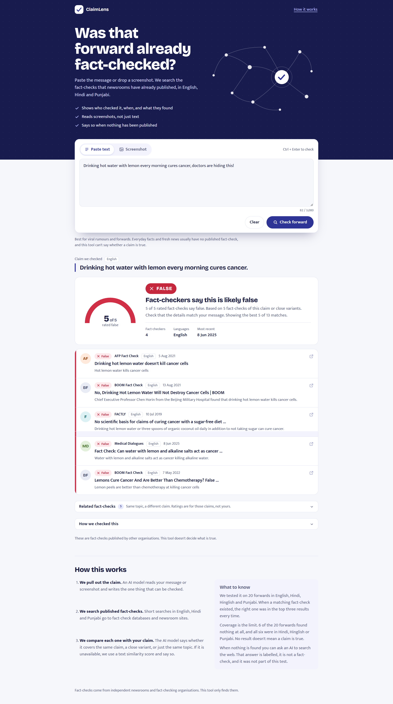
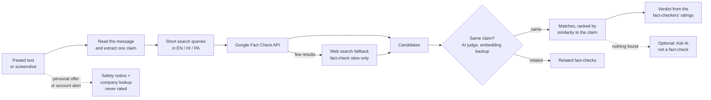

<div align="center">

# 🔍 ClaimLens

**Was that WhatsApp forward already fact-checked?**<br>
Paste a message or drop a screenshot. It finds the fact-checks that newsrooms have already published, in English, Hindi, Punjabi and Hinglish.




</div>

---

## Why this exists

Misinformation on WhatsApp spreads in regional languages, and most fact-checking tools work in English only. But most viral rumours have **already been debunked** by an independent newsroom somewhere. The hard part is finding that debunk from a forwarded message in Hindi, Punjabi or Hinglish, or from a screenshot.

This project does **not** decide what is true. It finds published fact-checks, checks that each one is about *the same claim*, and shows who checked it, when, and what they found.

## What it does

- **Reads text or screenshots.** Paste a forward, or drop or paste a chat screenshot. A vision model reads the text and pulls out the one checkable claim.
- **Works across four language styles.** English, Hindi (Devanagari), Punjabi (Gurmukhi) and Hinglish (Hindi or Punjabi in Roman letters).
- **Searches published fact-checks.** The Google Fact Check Tools API first, then a web-search fallback restricted to fact-checking sites.
- **Checks the match is real.** Search results are keyword matches, so an AI judge (with a local embedding model as a backup) decides whether each result covers the *same* claim, a related one, or just the same topic.
- **Says the answer plainly.** A verdict badge (False, Misleading, True, or mixed ratings) built from the fact-checkers' own ratings, with the sources underneath.
- **Says "nothing found" honestly.** If no fact-check exists, it says so and does not guess.
- **Optional AI second opinion.** When nothing is found, a separate button asks Gemini with Google Search to read current sources. It is **clearly labelled "not a fact-check"**, runs only on request, and was not part of the evaluation.
- **Flags lender offers instead of rating them.** A message like "Your loan amount has increased … account xxx8898" is an offer, not a rumour, so it is never given a true or false verdict. ClaimLens shows a safety notice and runs an automatic web lookup of whether the named company is registered (for example with the RBI). That lookup is labelled as checking **the company only, not whether the message is genuine**, because scammers copy real company names.

## Scope

ClaimLens does one thing: it finds **published fact-checks** for a claim. It is not a spam, scam or phishing detector.

| Input | What ClaimLens does |
|---|---|
| A viral claim or rumour | Searches published fact-checks and shows the ones about the same claim |
| A claim with no published fact-check | Says so. Offers the optional AI check, labelled "not a fact-check" |
| A personal offer or account alert (masked account number, "your loan amount", amounts) | Shows a safety notice and a company-registration lookup. **Never** rates the message true or false |
| A message with no checkable claim | Says so |

The related fact-checks shown under a result can be about a different claim on the same topic. They are shown in a neutral style, and the page says none of them rates your claim.

## How it works



1. **Extract.** One Gemini call returns the language, the single checkable claim, and very short search queries. Long queries return nothing from the Fact Check API, so queries are two to four words.
2. **Search.** Queries run in English, Hindi and Punjabi. If fewer than three results come back, shorter queries are tried, then the web-search fallback.
3. **Judge.** Each candidate is labelled *same* (the same rumour, even if it is a different instance), *related* (same topic, different rumour) or *unrelated*. If the AI service is unavailable, a local multilingual embedding model (`multilingual-e5-small`) takes over and the page says so.
4. **Rank.** Matches are ordered by embedding similarity to the claim, so the closest fact-check is first, not just the newest.
5. **Show.** The verdict is only as strong as the ratings behind it. Results without a rating never produce a verdict badge.

## Results

Everything was measured on hand-labelled data. The held-out set was frozen (prompt and thresholds fixed) **before** it was scored.

### Held-out test: 20 forwards, 11 of them Punjabi

14 forwards had at least one candidate, giving 52 real candidates plus 42 random negatives. Intervals are 95% bootstrap intervals from resampling claims. With 14 claims they are wide, so read them as a rough range.

| | Strict precision<br><sub>only "same rumour" counts</sub> | Strict recall | Family precision<br><sub>sibling rumours count too</sub> | Family recall |
|---|:-:|:-:|:-:|:-:|
| **AI judge** | **0.85** [0.59–1.00] | **1.00** | **1.00** | **0.92** |
| Embedding only (≥ 0.86) | 0.85 [0.60–0.97] | 0.56 | 0.92 | 0.48 |
| Always say "same" | 0.41 | 1.00 | 0.53 | 1.00 |

- **Ranking:** the correct fact-check was in the top 3 for 12 of 12 forwards that had one (top-1: 9 of 12, MRR 0.88).
- **Punjabi is the weak spot.** Embedding-only recall on Punjabi was 0.29, and AI-judge strict precision was 0.74. This is why the AI judge is the default and the embedding model is only a fallback.
- **Dev set** (10 forwards, 85 labelled rows with random negatives): AI judge precision 0.86 and recall 1.00; embedding top-1 ranking 10 of 10.

### Coverage is the real limit

| | |
|---|---|
| Forwards that found **no** candidate at all | 6 of 20, all Hindi, Hinglish or Punjabi |
| Forwards with an exact fact-check among those expected to have one | 8 of 12 |

Fact-checkers mostly publish in English, and the Fact Check API has thin Hindi and almost no Punjabi coverage. **No result does not mean a claim is true.** The tool says so on screen.

### Screenshot test: 11 synthetic images

Chat-style screenshots rendered from known hoax text: English, Hindi, Punjabi, Hinglish, one blurry, and two with no claim.

| Check | Result |
|---|:-:|
| Language label correct | 11 / 11 |
| Claim extracted faithfully | 9 / 9 |
| Images with no claim handled | 2 / 2 |
| Text read exactly | 10 / 11 |
| Top result about the same rumour | 8 / 8 matched rows |

> These images are clean and computer-made, so this is an easier test than real phone screenshots. Treat it as a smoke test, not as accuracy on real forwards.

## Quick start

**You need:** Python 3.10+, Node 18+, a [Gemini API key](https://aistudio.google.com/apikey), and a [Google Fact Check Tools API key](https://developers.google.com/fact-check/tools/api). A [Tavily](https://tavily.com) key is optional (web-search fallback).

### 1. Backend

```bash
cd backend
python -m venv .venv
# Windows: .venv\Scripts\activate      macOS/Linux: source .venv/bin/activate
pip install fastapi uvicorn python-dotenv requests google-genai sentence-transformers pydantic python-multipart
```

Create `backend/.env`:

```ini
GEMINI_API_KEY=your-gemini-key
FACTCHECK_API_KEY=your-fact-check-tools-key   # restrict this key to the Fact Check Tools API only
TAVILY_API_KEY=your-tavily-key                # optional

JUDGE_MODE=llm                                # "llm" (default in the app) or "embedding"
SAME_THRESHOLD=0.86
RELATED_THRESHOLD=0.83
```

Run it:

```bash
python -m uvicorn main:app --reload --port 8000
```

### 2. Frontend

```bash
cd frontend
npm install
npm run dev          # opens http://localhost:5173
```

The frontend calls `http://localhost:8000` by default. Set `VITE_API_URL` to change that.

### 3. Try it without the UI

```bash
cd backend
python pipeline.py                                   # five sample forwards
python try_ai_check.py "India won the T20 World Cup in 2024"
python test_screenshots.py screenshots               # folder of images named hi_*.png, pa_*.png, none_*.png ...
python test_notice.py                                # offer/alert rule: must catch alerts, flag none of the known rumours
```

## Configuration

| Variable | Default | What it does |
|---|---|---|
| `GEMINI_API_KEY` | none | Required. Reads claims, judges matches, and powers the AI check |
| `FACTCHECK_API_KEY` | none | Required. Google Fact Check Tools API |
| `TAVILY_API_KEY` | none | Optional web-search fallback |
| `GEMINI_MODEL` | `gemini-2.5-flash` | Main model |
| `GEMINI_FALLBACK_MODEL` | none | Used when the main model hits its quota |
| `GEMINI_GROUNDED_MODEL` / `GEMINI_GROUNDED_FALLBACK` | main model | Models for the "Ask AI" check (needs Google Search grounding) |
| `JUDGE_MODE` | `embedding` in code | `llm` uses the AI judge, with automatic embedding fallback |
| `SAME_THRESHOLD` / `RELATED_THRESHOLD` | `0.86` / `0.83` | Cut-offs for the embedding judge |
| `TAVILY_CAN_MATCH` | `0` | Set to `1` to let web-search results count as matches (off by default: unrated and not evaluated) |
| `RANK_MODEL` | `intfloat/multilingual-e5-small` | Model used to order results |

> **Free-tier note:** the free Gemini tier allows about 20 requests per model per day. Every response is cached in `llm_cache.json`, and the app falls back gracefully (second model, then embeddings) so a quota error never becomes a crash.

## API

| Method | Path | Body | Returns |
|---|---|---|---|
| `GET` | `/health` | none | `{ "ok": true }` |
| `POST` | `/check` | `{ "text": "…" }` (5–3000 chars) | status, extracted claim, matches, related |
| `POST` | `/check-image` | multipart `file` (PNG, JPG or WebP, up to 5 MB) | same, plus the text read from the image |
| `POST` | `/ai-check` | `{ "claim": "…", "message": "…", "kind": "claim" \| "company" }` (claim 5–600 chars, message up to 1500, `kind` defaults to `claim`) | verdict, summary with citations, sources. Rate-limited (5 per minute), cached 24 h |

`status` is one of `match`, `no_match`, `no_claim`, `notice` (a personal offer or account alert, with a `notice` object of safety points) or `unjudged` (search worked but the judge was unavailable).

`/ai-check` verdicts: for `kind: "claim"`, `supported`, `contradicted`, `mixed`, `unclear` or `not_a_claim`. For `kind: "company"`, `registered`, `not_found` or `unclear`. An answer with no web sources behind it is always returned as `unclear`.

## Project structure

```
backend/
├── main.py              FastAPI app: /check, /check-image, /ai-check
├── pipeline.py          extract → search → judge → rank, plus the offer/alert rule
├── claim_extractor.py   Gemini client, claim extraction (text and image), cache
├── factcheck_api.py     Google Fact Check Tools API client
├── fallback_search.py   Tavily search limited to fact-check sites
├── reranker.py          local embedding judge
├── rank.py              orders results by similarity to the claim
├── ai_check.py          Gemini + Google Search: the optional claim check and the company lookup
├── test_notice.py       tests the offer/alert rule against 90+ known claims
├── eval/                labelled data and evaluation scripts
├── test_screenshots.py  runs a folder of screenshots through the pipeline
└── try_ai_check.py      one-off test of the AI check
frontend/src/
├── App.jsx              page, input tabs, how-it-works
├── Results.jsx          verdict, offer notice, filters, result rows
├── AiCheck.jsx          the "Ask AI" panel and the company lookup panel
├── Graphics.jsx         icons and verdict gauge
└── factcheckUtils.js    verdict logic, de-duplication, formatting
```

## Reproduce the evaluation

Labels use four classes: **S** (same rumour, including other instances), **F** (a sibling rumour), **R** (same topic only), **U** (unrelated).

```bash
# dev set
python collect_pairs.py          # search and write candidates to label
#   label the CSV by hand, then:
python apply_relabel.py
python evaluate.py               # embedding judge
python eval_llm_judge.py         # AI judge
python eval_hybrid.py            # both together

# held-out set (freeze the prompt and thresholds first)
python collect_pairs_test.py
#   label, then:
python merge_labels.py
python evaluate_test.py          # strict and family metrics, bootstrap intervals, per-language
```

`evaluate_test.py` prints the prompt fingerprint and thresholds first so you can check nothing changed between labelling and scoring.

## Privacy and responsible use

- Text you paste and screenshots you upload are sent to **Google's Gemini API**. The UI says so and suggests cropping out names and phone numbers.
- The "Ask AI" check also sends the claim text to **Google Search**, and says so before you click.
- For an offer or account alert, the company lookup runs **automatically** and sends the message text to Gemini and Google Search. The panel says so. Do not paste messages that contain account numbers, OTPs or other secrets you do not want sent.
- Nothing is stored except the local response caches (`llm_cache.json`, `ai_cache.json`). Keep `.env` and both cache files out of git.
- The tool only points to published fact-checks. It never labels a claim true or false on its own authority, and it never presents the AI second opinion as a fact-check.

## Limitations

- **Coverage.** Most fact-checks are in English. Hindi is thin and Punjabi is close to empty in the Fact Check API.
- **Variants, not exact claims.** "Same rumour" includes other instances (a different video, amount or date). The page tells you to check that the details match your message.
- **Small test sets.** 20 held-out forwards means wide intervals, and the screenshot test is synthetic.
- **The AI check can be wrong.** It is outside the evaluation and is labelled that way.
- **Quota.** The free Gemini tier is small. Heavy use needs a paid key.
- **Search variation.** The Fact Check API returns slightly different results from run to run.
- **Spam and offer detection is deliberately narrow.** The offer rule needs three things at once: a masked account number such as `xxx8898`, "your"-style wording, and an amount or change word. It is built to avoid false alarms on rumours (0 false positives on the known test claims), so it misses offers that lack a masked number. Those go through the normal claim path.
- **The company lookup does not prove a message is real.** It can show a company is registered. It cannot show that this particular message came from it.

## Roadmap

- Translate Punjabi claims to English before embedding (Punjabi recall is the weakest point)
- Index a multilingual fact-check dataset to cover claims the API misses
- Real-screenshot test set
- A Telegram or WhatsApp bot front end
- Deployment

## Built with

[FastAPI](https://fastapi.tiangolo.com) · [React](https://react.dev) + [Vite](https://vitejs.dev) · [Google Gemini](https://ai.google.dev) · [Google Fact Check Tools API](https://developers.google.com/fact-check/tools/api) · [Tavily](https://tavily.com) · [sentence-transformers](https://www.sbert.net) with [`multilingual-e5-small`](https://huggingface.co/intfloat/multilingual-e5-small)

Fact-checks shown by the app belong to their publishers (Alt News, BOOM, The Quint, Vishvas News, AFP, Full Fact and others). This project only links to them.

---

<div align="center">
Built by Rajnish · an NLP course project<br>
Released under the MIT License
</div>
